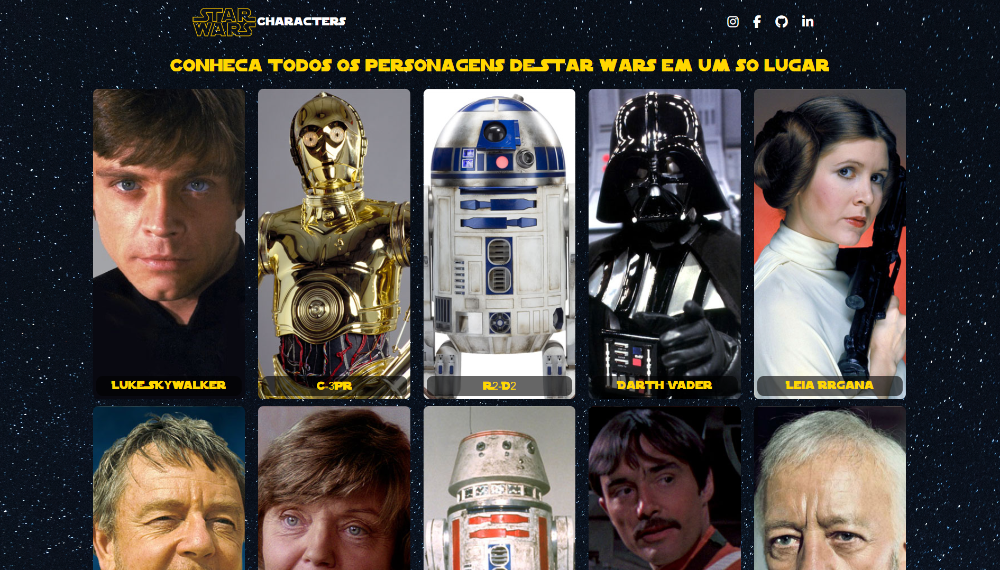

<h1 align="center">Star Wars Characters</h1>

Projeto prático II do curso profissão programador. 

  <a href="#-tecnologias">Tecnologias</a>&nbsp;&nbsp;&nbsp;|&nbsp;&nbsp;&nbsp;
  <a href="#-projeto">Projeto</a>&nbsp;&nbsp;&nbsp;|&nbsp;&nbsp;&nbsp;
  <a href="#-instruções">Instruções</a>&nbsp;&nbsp;&nbsp;|&nbsp;&nbsp;&nbsp;
  <a href="#memo-licença">Licença</a>

  

 

  

## 🚀 Tecnologias

Esse projeto foi desenvolvido com as seguintes tecnologias:

- JavaScript
- HTML
- CSS

## 💻 Projeto

Esse projeto traz várias informações sobre os personagens da franquia Star Wars. Essa aplicação possui uma paginação onde é possível navegar em meio a mais de 80 personagens. Ao clicar em um personagem, é aberto um modal com maiores informações sobre ele. Todas essas informações estão sendo obtidas através da API [Swapi](https://swapi.dev/). Foram colocados em prática consumo de API e manipulação de  elementos através de Javascript. 

## :memo: Licença

Esse projeto está sob a licença MIT.

